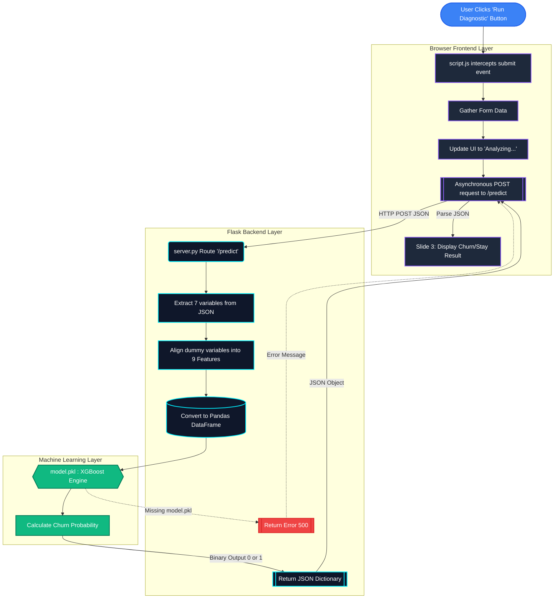

# System Architecture Flowchart

This flowchart illustrates exactly how data travels through the 3-Tier Web Application from the moment a user clicks "Predict" to the final result.

```mermaid
flowchart TD
    %% Define Styles
    classDef user fill:#3b82f6,stroke:#2563eb,stroke-width:2px,color:#fff
    classDef frontend fill:#1e293b,stroke:#8b5cf6,stroke-width:2px,color:#fff
    classDef backend fill:#0f172a,stroke:#00f0ff,stroke-width:2px,color:#fff
    classDef model fill:#10b981,stroke:#047857,stroke-width:2px,color:#fff
    classDef error fill:#ef4444,stroke:#dc2626,stroke-width:2px,color:#fff

    %% Nodes
    User([User Clicks 'Run Diagnostic' Button]):::user
    
    subgraph Browser Frontend Layer
        Form[Gather Form Data]:::frontend
        JS[script.js intercepts submit event]:::frontend
        UI[Update UI to 'Analyzing...']:::frontend
        Fetch[[Asynchronous POST request to /predict]]:::frontend
        DisplayResult[Slide 3: Display Churn/Stay Result]:::frontend
    end

    subgraph Flask Backend Layer
        API(server.py Route '/predict'):::backend
        Extract[Extract 7 variables from JSON]:::backend
        Align[Align dummy variables into 9 Features]:::backend
        Pandas[(Convert to Pandas DataFrame)]:::backend
        Response[[Return JSON Dictionary]]:::backend
        Err[[Return Error 500]]:::error
    end

    subgraph Machine Learning Layer
        Model{{model.pkl : XGBoost Engine}}:::model
        Predict[Calculate Churn Probability]:::model
    end

    %% Flow
    User --> JS
    JS --> Form
    Form --> UI
    UI --> Fetch
    
    %% API Request Boundary
    Fetch -->|HTTP POST JSON| API
    
    API --> Extract
    Extract --> Align
    Align --> Pandas
    Pandas --> Model
    
    %% ML Evaluation
    Model --> Predict
    Predict -->|Binary Output 0 or 1| Response
    
    %% Handling edge cases inside backend
    Model -.->|Missing model.pkl| Err
    Err -.->|Error Message| Fetch
    
    %% Return Path
    Response -->|JSON Object| Fetch
    Fetch -->|Parse JSON| DisplayResult
```
